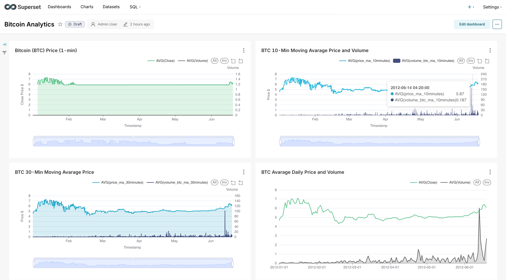

## Bitcoin Real-Time Data Pipeline
This project demonstrates a complete, end-to-end data engineering pipeline using Docker. It simulates a real-time stream of Bitcoin data, processes it in batches and streams with Spark, stores it in a data lake (MinIO) and a data warehouse (Postgres), and visualizes the results in a Superset dashboard that loads automatically.

### Dashboard Preview

Here is the final dashboard, which loads automatically on startup:


### Project Structure
```
.
├── data/
│   └── bitcoin_data.csv
├── images/
│   └── dashboard_preview.png
├── producer/
│   ├── __init__.py
│   ├── producer.py
│   ├── requirements.txt
│   ├── Dockerfile
├── spark/
│   ├── __init__.py
│   ├── spark_streaming.py
│   ├── spark_batch.py
│   ├── entrypoint.sh
│   └── Dockerfile
├── superset/
│   ├── init_superset.sh
│   └── my_dashboard_export.zip
├── tests/
│   ├── producer
│   │   ├── __init__.py
│   │   ├── producer_test.py
│   ├── spark
│   │   ├── __init__.py
│   │   ├── test_spark_batch.py
│   │   ├── test_spark_streaming.py
│   ├── Dockerfile
├── docker-compose.yaml
├── Dockerfile.test
├── postgres-multiple-db.sh
└── README.md
```


### Architecture
This pipeline follows a "Bronze" (raw) and "Gold" (aggregated) layer architecture.
#### 1. Producer:
- A Python script (`producer.py`) reads a historical Bitcoin CSV file and simulates a live data stream.
- It sends one data point (a 1-minute record) to a Kafka topic (`bitcoin_data`) every 0.1 seconds
#### 2. Ingestion (Spark Stream - "Bronze" Layer):
- The spark-processor service runs a continuous streaming job (`spark_streaming.py`).
- This job reads from the `bitcoin_data` Kafka topic.
- It casts data types, cleans the data, and writes it as raw Parquet files (partitioned by date) into a MinIO bucket: `streaming_raw`.
#### 3. Aggregation (Spark Batch - "Gold" Layer):
- The same `spark-processor` service runs a second job (`spark_batch.py`) in a 1-minute loop.
- This batch job reads the "Bronze" data from MinIO, applying an efficient "lookback" to process only new data.
- It calculates 5-minute, 10-minute, and 30-minute moving averages and volatility for each row using Spark Window functions (this prevents data duplication).
- It appends this new, enriched "Gold" data to two places:
    1. Postgres: A table named `bitcoin_gold_data` (for fast dashboarding).
    2. MinIO: A bucket named `gold_aggregates` (for analytics and backup).
#### 4. Visualization (Superset):
- The `superset` service starts and automatically connects to the Postgres database.
- On its first run, it executes an initialization script (`init_superset.sh`) that:
    1. Creates the admin user (`admin`/`admin`).Programmatically creates the database connection to your `crypto_db`.
    2. Imports a pre-built dashboard and all its charts from the my_dashboard_export.zip file.

### How to Run
#### 1. Clone the Repository:
```
git clone <this-repo-url-http-or-ssh>
cd crypto_data_platform
```

#### 2. Set Script Permissions (One-Time Setup): You must tell Git to track the executable permissions for the Postgres init script.
```
# Add the file to Git
git add postgres-multiple-db.sh

# Set the executable permission
git update-index --chmod=+x postgres-multiple-db.sh

# Commit this change (if you haven't already)
git commit -m "Set permissions for Postgres init script"
```

#### 3. Export Your Dashboard:
- This project assumes you have a file named `my_dashboard_export.zip` inside the `superset/` folder.
- If you haven't created this, you must run the project once, build your dashboard in the UI (following superset/dashboard_plan.md), and export it into that location.

#### 4. Download Kaggle Bitcoin Hitorical Dataset, unzip it, and paste it in the main directory of the project inside the `data` directory and rename it to `bitcoin_data.csv`:
`https://www.kaggle.com/api/v1/datasets/download/mczielinski/bitcoin-historical-data`

#### 5. Build and Run the Pipeline:
`docker compose up --build`

#### 6. Shut Down the Pipeline:
To stop all services and remove the data volumes, run:
`docker compose down -v`

### Startup and Monitoring
#### Startup Time
Initial Build: The first build can take 5-10 minutes as it downloads all the Docker images.
Regular Startup: A normal startup takes 2-5 minutes for all services to stabilize, run health checks, and for the Spark jobs to initialize.

#### Data Delay
- You will not see data in Superset instantly.
- Stream 1 (Raw Data): The streaming job (`spark_streaming.py`) writes to MinIO every 30 seconds.
- Stream 2 (Gold Data): The batch job (`spark_batch.py`) runs every 1 minute.
- Expect to wait 1-2 minutes after startup before data appears in your `bitcoin_gold_data` table and on the Superset dashboard.

#### Service Endpoints
###### * All usernames and passwords here are only defaults that can be made secret with .env file. For demonstration purposes I used defaults.
- Superset (Dashboard):
    - URL: `http://localhost:8088`
    - User: `admin`
    - Pass: `admin`
- MinIO (Data Lake):
    - URL: `http://localhost:9001`
    - User: `minioadmin`
    - Pass: `minioadmin`
    - Bucket: `bitcoin-data` (Contains `streaming_raw`/ and `gold_aggregates`/)
- Spark UI (Streaming Job):
    - URL: `http://localhost:4040`
    - This shows the Kafka-to-MinIO streaming job.
- Spark UI (Batch Job):
    - URL: `http://localhost:4041`
    - This shows the MinIO-to-Postgres aggregation job.
    - It only appears while the job is running (once per minute).
- Postgres (Database):
    - Host: `localhost`
    - Port: `5432`
    - User: `postgres`
    - Pass: `postgres`
    - Data DB: `crypto_db`
    - Superset DB: `superset`

### Testing
This project includes a suite of unit tests that can be run in a containerized environment.

#### 1. Build the Test Image:
```
docker build -t crypto-tests -f Dockerfile.test .
```

#### 2. Run the Tests:
```
docker run --rm crypto-tests
```
